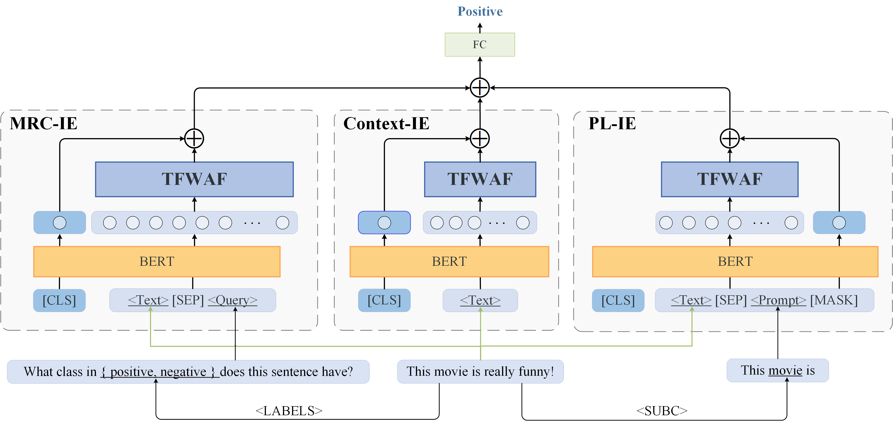
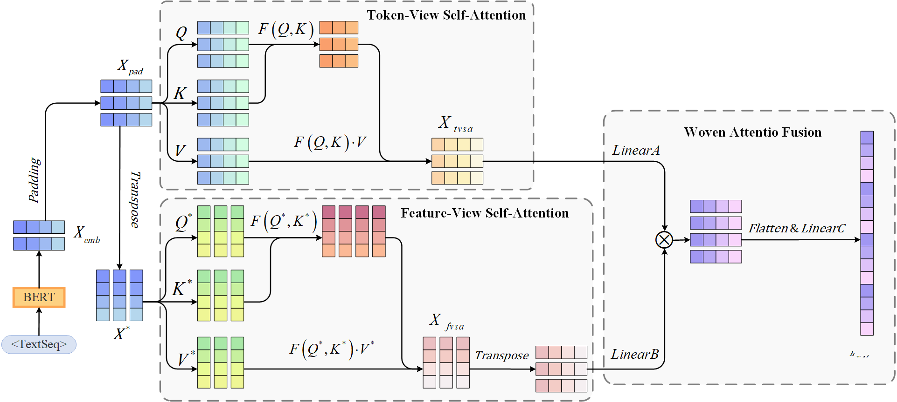

# MP-TFWAF: Multi-schema powered token-feature woven attention network for short text classification


**************************** **Updates** ****************************

* 2023/11/06: We released the second version of our paper. 
* 2023/07/27: We released the first version of our paper. 

## Overview






## Usage

We provide an easy-to-use python package `mptfwaf` which has the following functions:

**(1) Encode sentences into embedding vectors**

**(2) Analysis the sentiment polarity of the sentence**

To use the tool, first install the `mptf` package from PyPI

```bash
pip install mptf
```

After installing the package, you can load our model by two lines of code

```python
from mptf import MPTFWAF
model = MPTFWAF()
```

Then you can use our model for encoding sentences into embeddings. It is worth noting that the Embedding dimension of this sentence is 1*5304.

```python
embeddings = model.encode("Boys, you must strive to find your own voice.")
```

Analysis the sentiment polarity ( positive or negative ) of the input sentence. 

```python
sentence = ['Boys, you must strive to find your own voice.']
sentiment = model.analysis(sentence)
```

## Train MP-TFWAF

In the following section, we describe how to train a MP-TFWAF model by using our code.

### Setups

Run the following script to install the remaining dependencies

```
pip install -r requirement.txt
```

### Prepare the data

The folder "data" contains the MR dataset for testing. As for the other datasets, you can downloaded according to paper "[MODE-LSTM: A Parameter-efficient Recurrent Network with Multi-Scale for Sentence Classification](https://github.com/qianlima-lab/MODE-LSTM)".

Besides, you can also download the dataset from the [google-drive](https://drive.google.com/drive/folders/1sJFqMa6C2ZSFqriAglGYg3i74hjK7rFz?usp=drive_link).

### Training and evalution

You can run the command. 

```bash
python main.py
```

## Citation

If this work is helpful, please cite  as:
